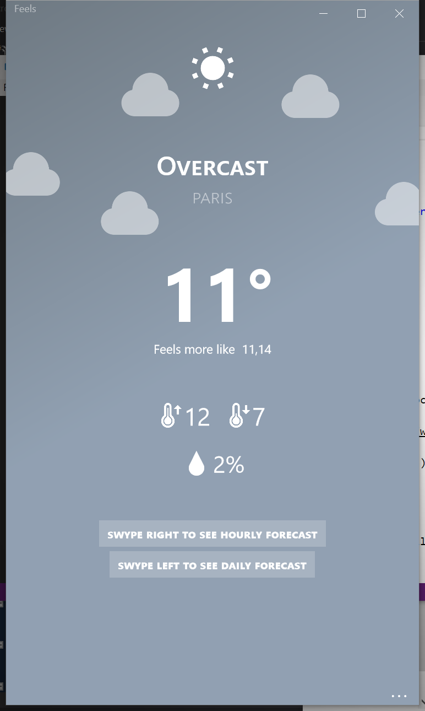

# Feels
Minimalistic weather app

## screenshot




## features

* Current weather based on geolocalization
* Hourly forecast
* Daily forecast

## setup
Steps to build and run this project:

1. Clone or download this repository
2. (Optional) Unzip the archive to your favorite location
3. Navigate to the ```Feels/``` folder
4. Open ```Feels.sln``` in [Visual Studio](https://www.visualstudio.com/thank-you-downloading-visual-studio/?sku=Community&rel=15)
5. Choose your favorite platform and click on Run :)


## architecture overview

This section describes the way I've organized my files and directories
to build this app in the clearest way possible.

**Views**

All the views are localized inside the ```Views/``` folder, except for the ```App.xaml``` and ```App.xaml.cs``` which is the main app's view page.

**Data**

All data are managed inside the ```Data/``` folder.

For more information, visit the corresponding folders.

## contributing

You can contribute to improve this project by:

* edit the code
* creating a pull request
* submitting new ideas / features suggestions 
* reporting a bug

## todo

* Live tile
* Lockscreen text status
* Lockscreen background
* Polish UI
* Add weather animations
* Add city manually

## platforms

* Windows Mobile 10
* Windows 10