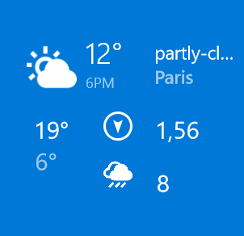

# Feels

Minimalistic weather app for universal windows platform.




## Status

[](https://appcenter.ms)

> This project is NOT maintained anymore.

> NOTE: To run this app locally, be sure to create an account on  [DarkSky](https://darksky.net/dev/login?next=/account) and create a new personal key to use in Feels app. See [section](#API-key).


## Features

* Current weather based on geolocalization
* Add city manually
* Hourly forecast
* Daily forecast
* Live tile
* Pin multiple locations to start view
* Lockscreen text status

## Setup
Steps to build and run this project:

1. Clone or download this repository
2. (Optional) Unzip the archive to your favorite location
3. Navigate to the ```Feels/``` folder
4. Open ```Feels.sln``` in [Visual Studio](https://www.visualstudio.com/thank-you-downloading-visual-studio/?sku=Community&rel=15)
5. Choose your favorite platform and click on Run :)


## Architecture overview

This section describes the way I've organized my files and directories
to build this app in the clearest way possible.

**Views**

All the views are localized inside the ```Views/``` folder, except for the ```App.xaml``` and ```App.xaml.cs``` which is the main app's view page.

**Data**

All data are managed inside the ```Data/``` folder.

For more information, visit the corresponding folders.

## Contributing

You can contribute to improve this project by:

* edit the code
* creating a pull request
* submitting new ideas / features suggestions
* reporting a bug

## Todo

* Lockscreen background

## Platforms

* Windows Mobile 10
* Windows 10


## API key

### Retrieve a new API key from DarkSky

To run this project, it's better to get your personal API key from DarkSky:

1. Login or Register a new account on [DarkSky](https://darksky.net/dev/login?next=/account)
2. On the account page, you'll get your Secret Key
3. Copy and paste the key when you create a new client:

```csharp
var client = new DarkSkyService("YOUR API KEY HERE");
```

### Where to past my DarkSky API key ?

Go in the `SourceModel` class in `Feels.Data` namespace (path `/Feels/Data/SourceModel.cs`).

You can then edit the line number `15` and paste your personal key

```cs
private const string _APIKey = "DARKSKY_API_KEY";
```

Replace the `DARKSKY_API_KEY` value by your new API key.

It should now work :)
